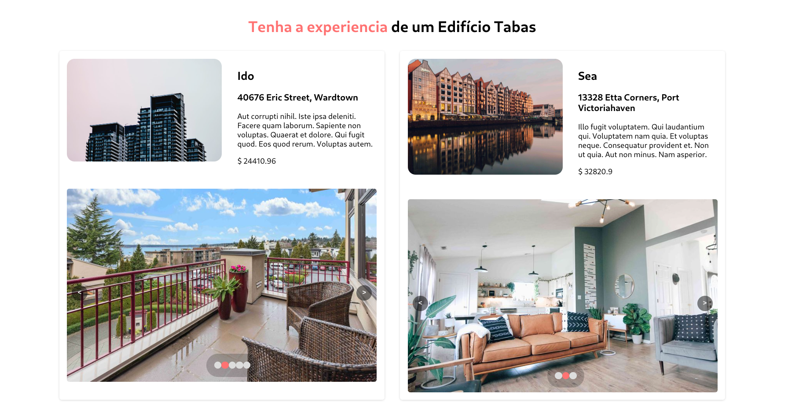

# Tabas

> 

## Requirements 

- Ruby on Rails v 7. x. For more information on how to install Ruby on Rails, please follow this [link](https://guides.rubyonrails.org/getting_started.html)

- Make sure you have PostgreSQL installed on your machine. [This tutorial](https://www.digitalocean.com/community/tutorials/how-to-install-and-use-postgresql-on-ubuntu-18-04) is an example of how to set it up on Ubuntu.

- Node.js v 16 or greater. More information [here](https://nodejs.org/en/)

- Yarn. More information [here](https://www.npmjs.com/package/yarn) 

## Server

Open the terminal and enter the following commands:

```
cd api/

# install dependencies
bundle install

# create and seed database
rails db:create && rails db:migrate && rails db:seed

# launch the server
rails server
```

### Sever Tests

To run the test suite:

```
rspec .
```

## React App

Open another terminal and run the following command:

```
cd frontend/

# copy .env file
cp .env.example .env

# install dependencies
yarn install

# launch the server
yarn start
```

### React Tests

To run the test suite:

```
yarn test
```

## Authors

👤 **Gustavo Carvalho**

- GitHub: [@gscarv13](https://github.com/gscarv13)
- LinkedIn: [Gustavo Carvalho](https://www.linkedin.com/in/gscarv13)
